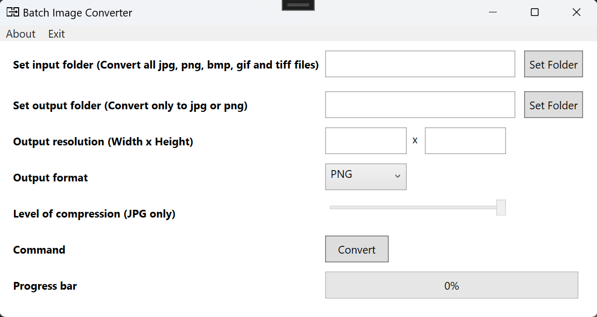

**Batch Image Converter**
=======================

A simple batch image converter.  

 
This program converts batches of image files from JPG, PNG, BMP, GIF, or TIFF to PNG or JPG formats.
 
It prompts the user for the input and output folders.
 
The program also requests the desired output resolution. If only one value is provided, it maintains the aspect ratio of the original image.
 
Additionally, it asks for the output format (JPG or PNG). If JPG is selected as the output format, the program will inquire about the level of JPG compression.
 
Users can also choose the resize algorithm, with options including Bicubic, Lanczos, and Spline. 
 
When the user presses the "Convert" button, the program converts all images in the input folder and saves them to the output folder, retaining the original filenames. If the output file already exists, it will be overwritten.
  

Made for windows. Tested on windows 11.
  

*Written in C# 
Microsoft Visual Studio Community 2022 - Version 17.9.0 Preview 1.1 
Microsoft .NET 8.0 
Using the WPF Framework*