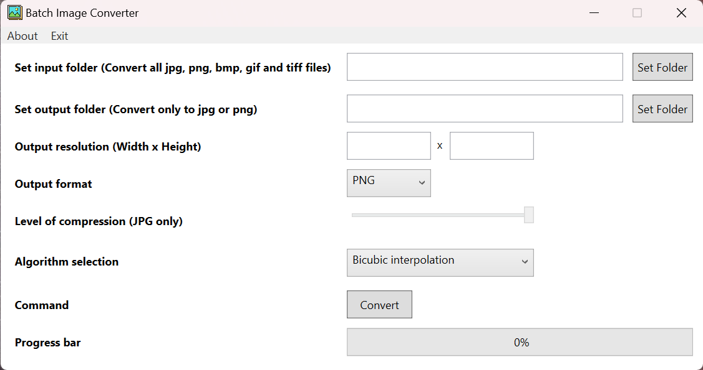

**Batch Image Converter**
=======================

A simple batch image converter.  

 
It ask the user for the input and output folders. 
Also ask for the output resolution and the output format (jpg or png). 
In case the user select jpg as the output format the program will ask for the level of compression of the jpg.  
When the user press the "Convert" button, it will convert all the jpg, png, bmp, gif and tiff files inside the input folder.

Made for windows. Tested on windows 11.

*Written in C# 
Microsoft Visual Studio Community 2022 - Version 17.8.0 Preview 1.0 
Microsoft .NET Framework Version 4.8.09032 
Using the WPF Framework*